# Terraform Virtual Machine Workshop

Este taller tiene como objetivo desplegar una máquina virtual (VM) utilizando Terraform, pero dividiendo el código en los módulos:

- `vm`: recursos generales de la VM.
- `networking`: recursos relacionados con la parte del manejo de red

A continuación, se detallan los pasos esenciales para la configuración y despliegue de la infraestructura.  

## By

Yuluka Gigante Muriel

---

## Inicialización del proyecto  

Antes de comenzar, es necesario inicializar el directorio de trabajo con Terraform. Esto se hace ejecutando:  

```bash
terraform init
```  

Este comando descarga los proveedores necesarios y prepara el entorno para trabajar con Terraform.

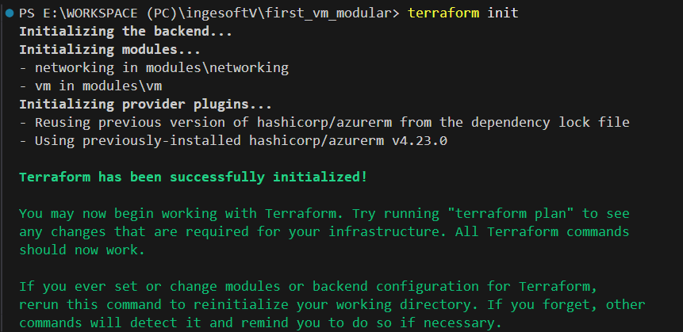

## Validación de la configuración  

Para estar seguros de que la configuración es correcta y no tiene errores de sintaxis, se usa el comando:  

```bash
terraform validate
```  

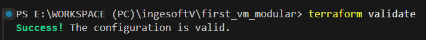

Dado que no se muestran errores, se puede saber que la configuración es válida.

## Uso del módulo `vm`

El módulo `vm` se encarga de aprovisionar una máquina virtual Linux en Azure, configurando su red y seguridad. Para utilizarlo, se debe incluir en el archivo `main.tf` del proyecto y definir las variables requeridas. Por ejemplo:

```hcl
module "vm" {
  source               = "./modules/vm"
  var1                 = var1_value
  var2                 = var2_value
  ...
}
```

En este caso, las variables requeridas son:

| Variable                | Descripción                                          | Tipo     |
|-------------------------|------------------------------------------------------|----------|
| `location`              | Región de Azure donde se desplegará la VM            | `string` |
| `resource_group_name`   | Nombre del grupo de recursos                         | `string` |
| `subnet_id`             | ID de la subred donde se conectará la NIC            | `string` |
| `public_ip_address_id`  | ID de la IP pública asociada a la VM                 | `string` |
| `admin_password`        | Contraseña del usuario administrador de la VM        | `string` |

## Uso del módulo `networking`

El módulo `networking` se encarga de crear los recursos de red necesarios para la infraestructura, incluyendo la red virtual, la subred y la IP pública. Para utilizarlo, se debe incluir en el archivo `main.tf` del proyecto y definir las variables requeridas. Por ejemplo:

```hcl
module "networking" {
  source               = "./modules/vm"
  var1                 = var1_value
  var2                 = var2_value
  ...
}
```

En este caso, las variables requeridas son:

| Variable                | Descripción                                          | Tipo     |
|-------------------------|------------------------------------------------------|----------|
| `location`              | Región de Azure donde se desplegará la VM            | `string` |
| `resource_group_name`   | Nombre del grupo de recursos                         | `string` |


Este módulo tiene una particularidad con respecto al anterior, y es porque acá es donde se definen los recursos de la subnet (`azurerm_subnet.mi_primera_vm_subnet`) y la IP pública (`azurerm_public_ip.mi_primera_vm_public_ip`). Por ende, para poder usarlos como inputs del módulo `vm`, es necesario exportarlos desde el archivo `outputs.tf`, así:

```hcl
output "subnet_id" {
  value = azurerm_subnet.mi_primera_vm_subnet.id
}

output "public_ip_address_id" {
  value = azurerm_public_ip.mi_primera_vm_public_ip.id
}
```

> **Nota:** Se exportan los ID porque es la información que se usa en `vm`. De ser necesario, podría exportarse cualquier otro valor.

## Verificación de la infraestructura  

Antes de aplicar los cambios, se pueden previsualizar qué recursos se crearán, y si hay algún problema con estos, ejecutando:

```bash
terraform plan
```

El resultado de este comando se verá así:

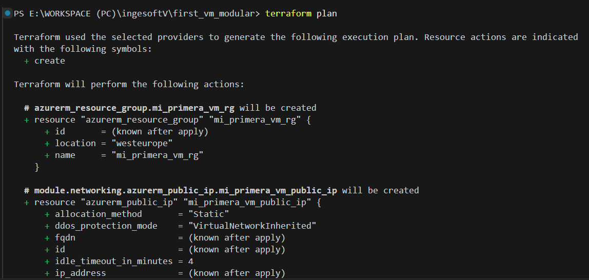

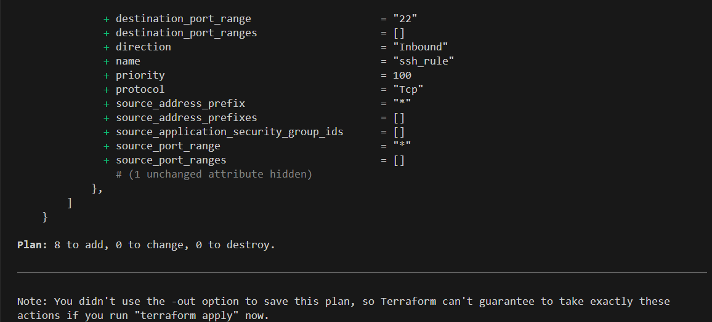

En caso de que todo sea correcto, se debe aplicar la configuración para desplegar la infraestructura:  

```bash
terraform apply
```

El resultado de este comando debería verse así:

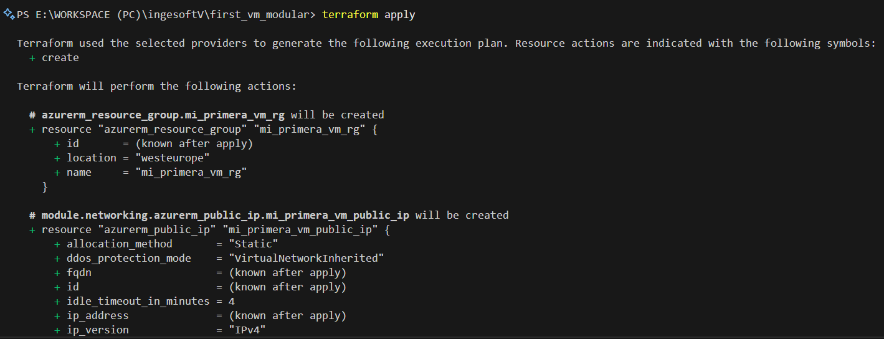

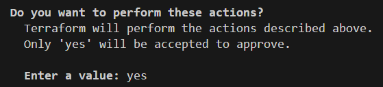

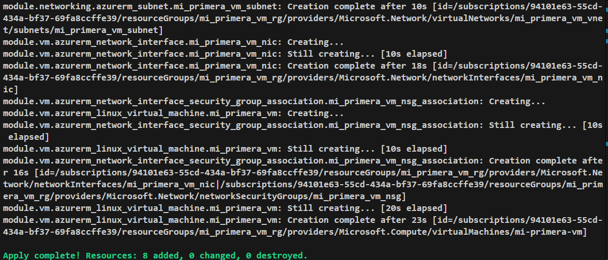


## 5. Comprobación de los recursos  

Para verificar que los recursos se han creado correctamente, se puede revisar en el panel de administración:  

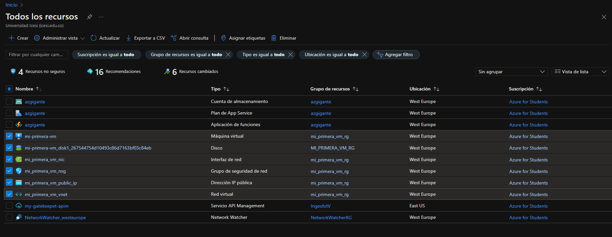

## 6. Conexión a la Máquina Virtual  

Si todo está funcionando correctamente, ahora se puede hacer la conexión a la VM mediante SSH. 

Para esto, se puede ver la IP pública de la VM, entrando al recuerso dentro de Azure:

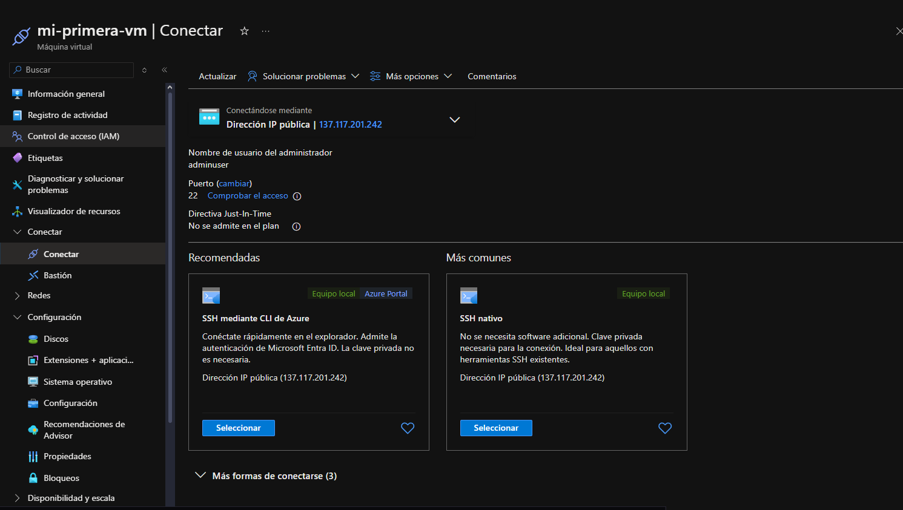

Teniendo esta información, y las credenciales definidas en el proyecto, el comando a ejecutar es:

```bash
ssh adminuser@137.117.201.242
```

El resultado debería verse así:

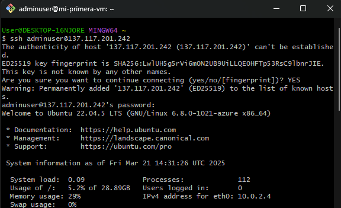

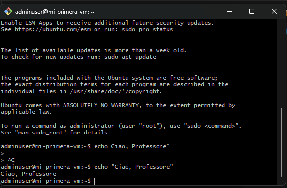

La conexión fue exitosa, lo que indica que la infraestructura está funcionando bien :-)